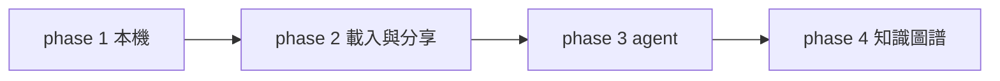
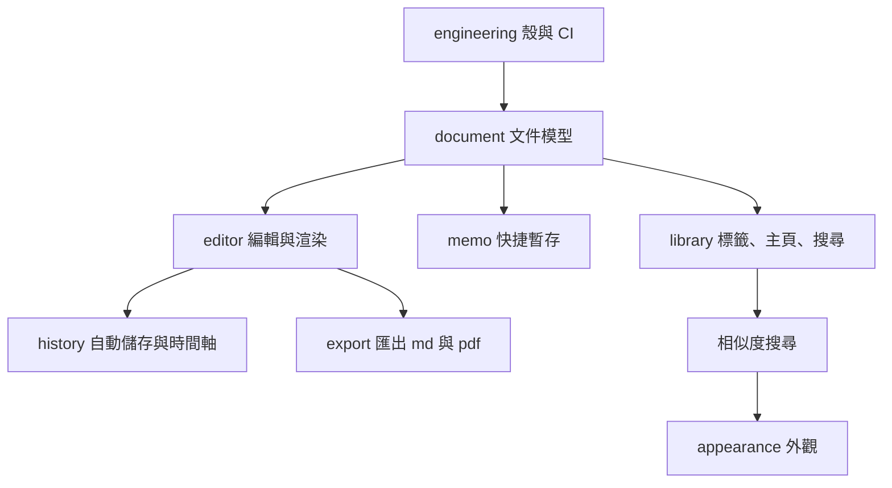

# Eyja 開發總覽

這份只放地圖、順序、已經定下來的事。設計細節寫在下面的檔案，改了請留在原檔。

每份檔案都用這三塊：

- **共識**：已經談過的前提。
- **先照這個做**：還沒有親口定死，但先依此準備，避免以後改資料庫。不對就改。
- **待決定**：每一項下面有 `A:`。確定的把方框勾起來，並在 `A:` 寫結論。不確定的不要勾，把想法留在 `A:`。
- **我的筆記**：你自己補。

---

## 階段

| 階段  | 目錄                             | 做到什麼               | 狀態    |
| --- | ------------------------------ | ------------------ | ----- |
| 前期  | [phase-1](phase-1/document.md) | 本機能寫、能暫存、能找、能匯出    | 討論中   |
| 中期  | [phase-2](phase-2/import.md)   | 載入檔案、編譯 LaTeX、唯讀分享 | 先記想法  |
| 後期  | [phase-3](phase-3/agent.md)    | 只碰指定範圍的 AI agent   | 之後再設計 |
| 終極  | [phase-4](phase-4/graph.md)    | 知識圖譜，再收成一篇文章       | 之後再設計 |

---

## phase 1 檔案

功能先做完，主頁外觀放在這一期的最後。

| 檔案                                       | 裝什麼                                  |
| ---------------------------------------- | ------------------------------------ |
| [document.md](phase-1/document.md)       | 筆記和 memo 共用的文件、附件、連結                 |
| [editor.md](phase-1/editor.md)           | 像 Obsidian 那樣寫、當場渲染、最近檔案、split、片段、跳轉 |
| [memo.md](phase-1/memo.md)               | 快捷鍵叫出，暫存文字、公式、圖片、檔案                  |
| [library.md](phase-1/library.md)         | 標籤、主頁列表、新增、搜尋                       |
| [appearance.md](phase-1/appearance.md)   | 功能做完之後的主頁外觀                          |
| [history.md](phase-1/history.md)         | 自動儲存、時間軸                             |
| [export.md](phase-1/export.md)           | 匯出 Markdown 和 PDF                    |
| [engineering.md](phase-1/engineering.md) | Tauri、Rust、SQLite、CI                 |

---

## 已經定下來的

- 殼是 Tauri 2。前端用 React，介面文字用英文，前期不做語言切換。領域和存檔在 Rust。CI 用 GitHub Actions。
- 資料庫是 SQLite，一台機器一份檔，加上硬碟上的 `assets/`。不用 PostgreSQL。
- 內文是 Markdown。圖片和 gif 是檔案。方程式、表格、程式碼區塊寫在內文裡，當場畫出來。
- 前期要有編輯器、memo、標籤、主頁、自動儲存、時間軸、匯出 md 和 pdf。
- 前期的 PDF 來自畫面上的渲染結果。匯出只做目前這一篇。Markdown 裡的 `[[文件]]` 改成標題文字。PDF 單欄，頁首是標題，頁尾是頁碼，紙張預設 A4。真正編譯 LaTeX 在 phase 2。
- 主頁第一版是文件列表加設定。標籤是扁平名稱。一篇文件預設最多 5 個標籤，上限可改。相似度搜尋在前期功能尾端。外觀在 [appearance.md](phase-1/appearance.md)，功能做完再決定。
- 編輯器用 CodeMirror 6。片段字典前期有表格、LaTeX 矩陣、程式碼圍欄。引用可以打 `[[` 選，也可以開視窗挑。
- 時間軸預設停下 2 分鐘一版、連續編輯每 5 分鐘一版，間隔可在主頁設定裡改。Ctrl+S 立刻寫入現稿，並在內容有變時另記一版。版本存差異，前期可預覽並還原。預設不淘汰舊版。
- memo 是獨立小視窗，預設 `Ctrl+Shift+M`，可改。檔案和資料夾複製進來。預設留到自己刪，期限可在設定裡開。

## 開始寫程式前還開著的

目前沒有。

## 先不排

這裡只留位置，不進前期，也不在這裡做設計。

**多人同步。** 別人也裝了 app，像在同一個私人網路裡。到時候每人仍是一份 SQLite，同步的是文件變更。不引入 PostgreSQL。

**加密。** 兩件分開考慮：

- 本機這份資料。SQLite 檔和 `assets/` 被直接拷走時，沒有密碼是否仍然讀得懂。
- 送出去的內容。唯讀分享，以及上面的多人同步，傳輸時要不要加密。分享本身見 [share.md](phase-2/share.md)。

**我的筆記**

## 討論紀錄

- 2026-10-04：本機用 SQLite。圖片走檔案，方程式走 LaTeX。編輯器的使用方式像 Obsidian，元件尚未選定。
- 2026-10-04：確認整個大綱都用 SQLite，不用 PostgreSQL。多人連線之後再想。
- 2026-10-04：加密先不排。本機資料和送出去的內容分開考慮。
- 2026-10-04：程式碼區塊跟方程式、表格一樣，寫在 Markdown 裡並當場渲染。
- 2026-10-04：文件刪除時留下本體和圖片，用 `deleted_at` 標記。有資料夾，標籤跨資料夾。連結的 `anchor` 存句子文字。
- 2026-10-04：文件可以置頂、收藏。封面可選，從文內已有圖片挑選，不另做圖。
- 2026-10-04：最近列表約露出 10 筆、可捲動。分割為左右兩組，每組最多 3 篇分頁，可拖移。編輯器元件先用 CodeMirror 6，尚未勾選。
- 2026-10-04：確定用 CodeMirror 6。片段字典前期三個範本。引用同時有 `[[` 候選清單和挑選視窗。
- 2026-10-04：前端用 React。
- 2026-10-04：時間軸預設閒置 2 分鐘與每 5 分鐘各記一版，可在設定調整。版本存差異，可預覽、還原。預設保留全部。
- 2026-10-04：Ctrl+S 立刻寫入現稿；內容有變時同時在時間軸記一版。
- 2026-10-04：memo 為小視窗，預設 Ctrl+Shift+M。檔案與資料夾複製進 app。預設保留到自己刪，期限可在設定開啟。
- 2026-10-04：主頁第一版是文件列表。標籤上限預設 5，可在設定更改。相似度搜尋放在前期尾端。外觀另寫在 appearance.md。
- 2026-10-04：標籤用扁平名稱，分層交給資料夾。
- 2026-10-04：匯出只含目前這一篇。Markdown 引用改成標題文字。PDF 有標題頁首、頁碼，紙張預設 A4。
- 2026-10-04：介面用英文，前期不做語言切換。CI 用 GitHub Actions。

