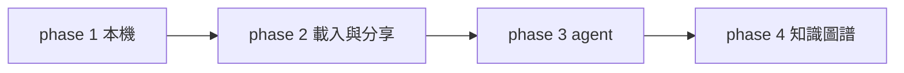
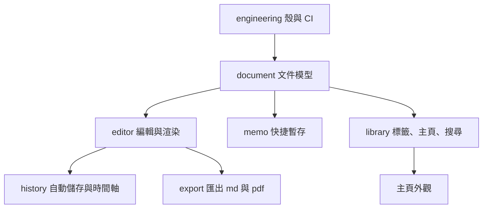

# Eyja 開發總覽

這份只放地圖、順序、已經定下來的事。設計細節寫在下面的檔案，改了請留在原檔。

每份檔案都用這三塊：

- **共識**：已經談過的前提。
- **先照這個做**：還沒有親口定死，但先依此準備，避免以後改資料庫。不對就改。
- **待決定**：每一項下面有 `A:`。確定的把方框勾起來，並在 `A:` 寫結論。不確定的不要勾，把想法留在 `A:`。
- **我的筆記**：你自己補。

---

## 階段

| 階段 | 目錄 | 做到什麼 | 狀態 |
| --- | --- | --- | --- |
| 前期 | [phase-1](phase-1/document.md) | 本機能寫、能暫存、能找、能匯出 | 討論中 |
| 中期 | [phase-2](phase-2/import.md) | 載入檔案、編譯 LaTeX、唯讀分享 | 先記想法 |
| 後期 | [phase-3](phase-3/agent.md) | 只碰指定範圍的 AI agent | 之後再設計 |
| 終極 | [phase-4](phase-4/graph.md) | 知識圖譜，再收成一篇文章 | 之後再設計 |

---

## phase 1 檔案

功能先做完，主頁外觀放在這一期的最後。

| 檔案 | 裝什麼 |
| --- | --- |
| [document.md](phase-1/document.md) | 筆記和 memo 共用的文件、附件、連結 |
| [editor.md](phase-1/editor.md) | 像 Obsidian 那樣寫、當場渲染、最近檔案、split、片段、跳轉 |
| [memo.md](phase-1/memo.md) | 快捷鍵叫出，暫存文字、公式、圖片、檔案 |
| [library.md](phase-1/library.md) | 標籤、主頁、新增、搜尋 |
| [history.md](phase-1/history.md) | 自動儲存、時間軸 |
| [export.md](phase-1/export.md) | 匯出 Markdown 和 PDF |
| [engineering.md](phase-1/engineering.md) | Tauri、Rust、SQLite、CI |

---

## 已經定下來的

- 殼是 Tauri 2。領域和存檔在 Rust，畫面在前端。
- 資料庫是 SQLite，一台機器一份檔，加上硬碟上的 `assets/`。不用 PostgreSQL。
- 內文是 Markdown。圖片和 gif 是檔案。方程式、表格、程式碼區塊寫在內文裡，當場畫出來。
- 前期要有編輯器、memo、標籤、主頁、自動儲存、時間軸、匯出 md 和 pdf。
- 前期的 PDF 來自畫面上的渲染結果。真正編譯 LaTeX 在 phase 2。
- 主頁的自訂方塊和時鐘是前期的最後一項。

## 開始寫程式前還開著的

確定的勾起來，並在 `A:` 寫結論。不確定的不要勾，把想法留在 `A:`。細節也可以直接改對應的檔案。

- [ ] 前端用 React 還是 Svelte。[engineering.md](phase-1/engineering.md)

  A:

- [ ] 編輯器元件用 CodeMirror 6 的即時預覽，還是 Milkdown。寫法已經定成 Obsidian 那種。[editor.md](phase-1/editor.md)

  A:

- [ ] 時間軸多久留一版。[history.md](phase-1/history.md)

  A:

- [ ] memo 裡的檔案和資料夾，是附在一則 memo 上，還是別的形態。[memo.md](phase-1/memo.md)

  A:

## 先不排

這裡只留位置，不進前期，也不在這裡做設計。

**多人同步。** 別人也裝了 app，像在同一個私人網路裡。到時候每人仍是一份 SQLite，同步的是文件變更。不引入 PostgreSQL。

**加密。** 兩件分開考慮：

- 本機這份資料。SQLite 檔和 `assets/` 被直接拷走時，沒有密碼是否仍然讀得懂。
- 送出去的內容。唯讀分享，以及上面的多人同步，傳輸時要不要加密。分享本身見 [share.md](phase-2/share.md)。

**我的筆記**

## 討論紀錄

- 2026-10-04：本機用 SQLite。圖片走檔案，方程式走 LaTeX。編輯器的使用方式像 Obsidian，元件尚未選定。
- 2026-10-04：確認整個大綱都用 SQLite，不用 PostgreSQL。多人連線之後再想。
- 2026-10-04：加密先不排。本機資料和送出去的內容分開考慮。
- 2026-10-04：程式碼區塊跟方程式、表格一樣，寫在 Markdown 裡並當場渲染。
